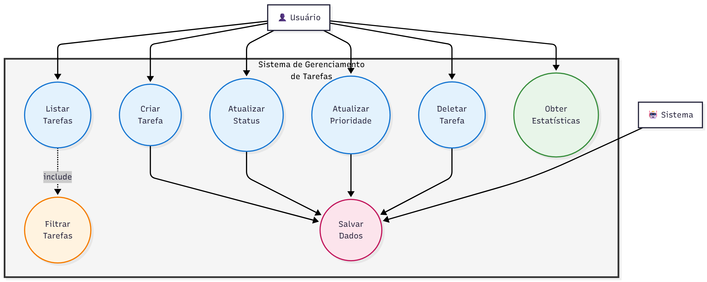
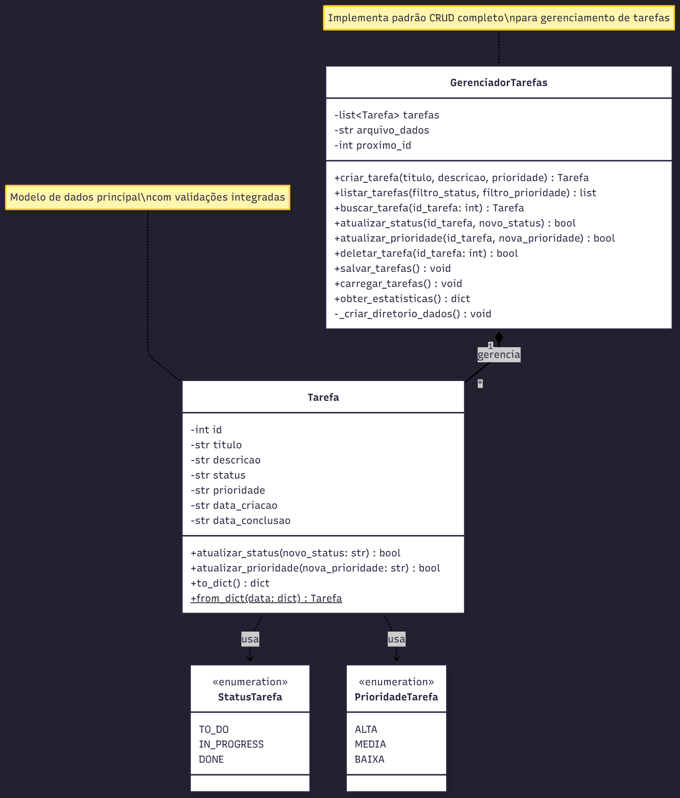

# 📚 Documentação do Projeto

Esta pasta contém a documentação técnica do Sistema de Gerenciamento de Tarefas Ágil.

## 📊 Diagramas UML

### Diagrama de Casos de Uso

Mostra as interações entre os usuários e o sistema.

### Diagrama de Classes

Representa a estrutura de classes e seus relacionamentos.

## 📝 Como Criar os Diagramas

1. Acesse: https://app.diagrams.net/
2. Crie os diagramas conforme especificação
3. Exporte como PNG
4. Faça upload nesta pasta

---

**Última atualização:** Novembro 2025
